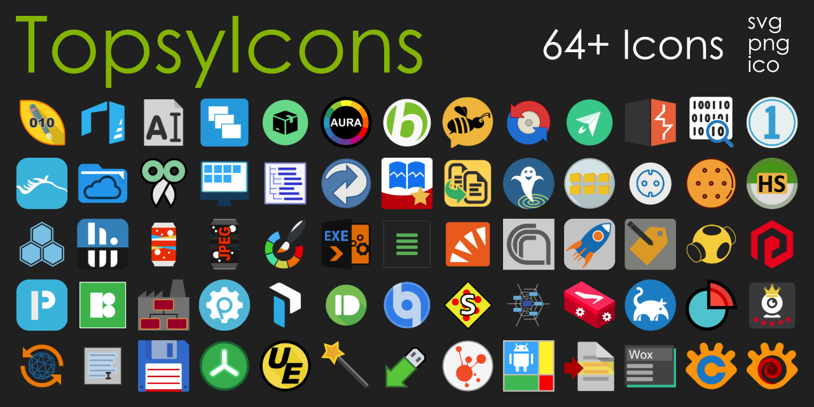
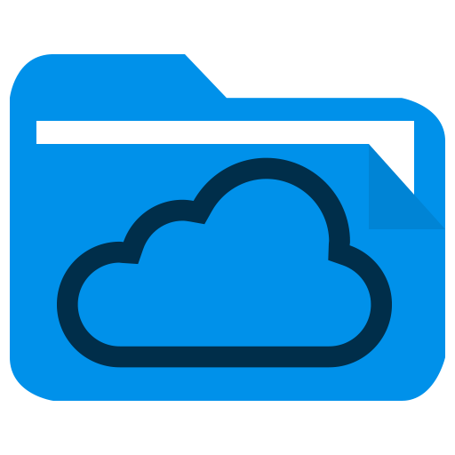

# 🐱‍🐉 TopsyIcons

Unfortunately many tools still don't provide flat icons in a proper resolution.
To get HDPI icons on my desktop anyway, I recreated a few of them over time. The icons are located in:  
[src/main/resources/](src/main/resources/)  
Every icon is ready to use and provided as `svg`, `png` and `ico` file.
> 😅 I'm not a designer, and the icons don't share a common style guide.
> This is not a recommendation for the (mostly Windows) tools themselves.

## ⭐ Features
  ⭐ Scalable Vector Graphics  
  ⭐ PNG Images with 512 px height  
  ⭐ Windows ICO files included  
  ⭐ Flat design  
  ⭐ Support for dark & white theme

## [📦 Download all Icons as Zip](https://github.com/TobseF/TopsyIcons/releases/latest/download/TopsyIcons.zip)  

If you are looking for additional nice and flat icons for Windows, check out my   
👉 [Papirus PNG & ICO Fork](https://github.com/TobseF/papirus-icon-theme-png-windows).

## 🧭  All Icons
||||||||
|---|---|---|---|---|---|---|
||||||||
|010 Editor|3D Builder|Advanced Renamer|AllDub|APK Easy Tool|AURA|Babylon|
||||||||
|BeeChat|Beyond Compare|BoostNote|BurpSuite|Bytecode Viewer|Capture One|CHITUBOX|
||||||||
|Cloud Explorer|CopyQ|DesktopOK|Directory List & Print|DirSync|DM Fotowelt|Duplicate|
||||||||
|Event Ghost|FileTypes Man|Fritz Power Line|Guetzli Converter|HeidiSQL|Hex Editor|HTTrack Website Copier|
||||||||
|HWiNFO|JPEGmini|JPEGmini Pro|Krita|Launch4J|Launchbox|LogCat|
||||||||
|MailStore|Meshlab|Mission Control|MP3 Tag Editor|mpv Mediaplayer|OpenScad|Photonster|
||||||||
|Photon Workshop|Picon|PlantUML|Prepros|Proguard|Pushbullet|qBittorent|
||||||||
|Sandbox|Sandbox Config|SciaReto|ShoeBox|SourceTrail|SpaceMonger|SparkoCam|
||||||||
|Spin 3D Mesh Converter|Textify|Total Commander|TreeSize|UltraEdit|Unlocker|USB Safely Remove|
||||||||
|Vector Magic|Visual VM|Windroye|WinMerge|Wox Launcher|XnConvert|XnView|

## 📜 Licence

  
This work is marked with [CC0 1.0 Universal](http://creativecommons.org/publicdomain/zero/1.0?ref=chooser-v1)